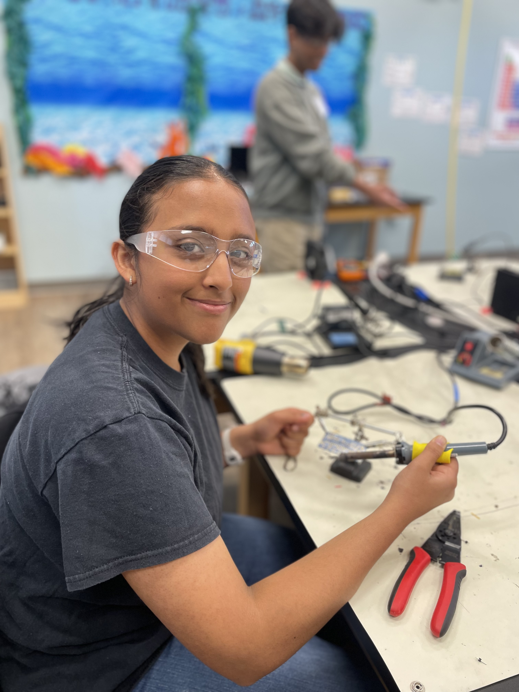
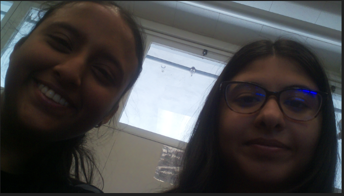
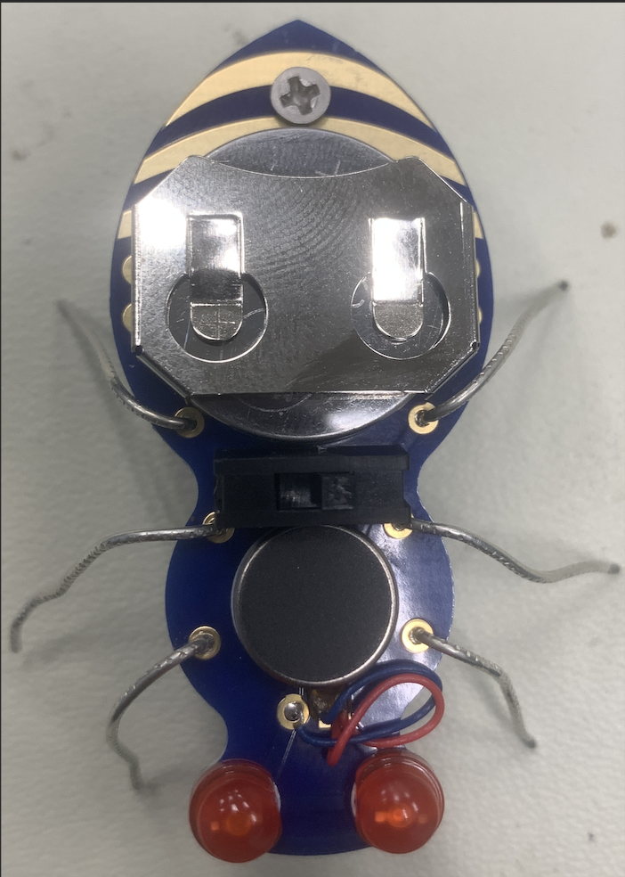
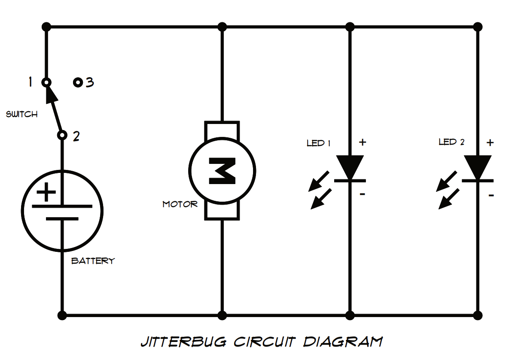

# Smart Glasses
The smart glasses help you recognize the objects around you in the world. Using rapberry pi and a picam, I am able to detect objects using tensor flow, which also has a speech output. So, whenever an object is put in front of it, it is able to detect the object and say the name of the object detected outloud.<!-- need to add more-->

| **Engineer** | **School** | **Area of Interest** | **Grade** |
|:--:|:--:|:--:|:--:|
| Pragti G | Monta Vista High School | Software Engineering | Incoming Junior

<!--Replace the BlueStamp logo below with an image of yourself and your completed project. Follow the guide [here](https://tomcam.github.io/least-github-pages/adding-images-github-pages-site.html) if you need help. -->

  
<!--# Final Milestone

**Don't forget to replace the text below with the embedding for your milestone video. Go to Youtube, click Share -> Embed, and copy and paste the code to replace what's below.**

<iframe width="560" height="315" src="https://www.youtube.com/embed/F7M7imOVGug" title="YouTube video player" frameborder="0" allow="accelerometer; autoplay; clipboard-write; encrypted-media; gyroscope; picture-in-picture; web-share" allowfullscreen></iframe>

For your final milestone, explain the outcome of your project. Key details to include are:
- What you've accomplished since your previous milestone
- What your biggest challenges and triumphs were at BSE
- A summary of key topics you learned about
- What you hope to learn in the future after everything you've learned at BSE
-->


# Second Milestone


<iframe width="560" height="315" src="https://www.youtube.com/embed/QT4CJaUCVO4?si=ClKCGyMrA-sgbFvg" title="YouTube video player" frameborder="0" allow="accelerometer; autoplay; clipboard-write; encrypted-media; gyroscope; picture-in-picture; web-share" referrerpolicy="strict-origin-when-cross-origin" allowfullscreen></iframe>

For your second milestone, explain what you've worked on since your previous milestone. You can highlight:
- Technical details of what you've accomplished and how they contribute to the final goal
- What has been surprising about the project so far
- Previous challenges you faced that you overcame
- What needs to be completed before your final milestone


## Summary
## Steps
#### Update the Raspberry Pi
```bash
sudo apt update
sudo apt upgrade -y
sudo apt install -y python3-pip
sudo apt install --upgrade -y python3-setuptools
```
Pip is a python package installer for python 3

#### Setup Virtual Environment
```bash
sudo apt install python3.11-venv
python -m venv env --system-site-packages
```
Ran commands that allow me to create a virtual environment in python - important because it allows me to run codes in an isolated environment
Creates env
Not understanding this caused a lot of problems due to global files interfering with files i was trying to install in virtual environments
```bash
source env/bin/activate
```
- activates the environment created


#### Upgrade Script
```bash
cd ~
sudo pip3 install --upgrade adafruit-python-shell
wget https://raw.githubusercontent.com/adafruit/Raspberry-Pi-Installer-Scripts/master/raspi-blinka.py
sudo python3 raspi-blinka.py
```
This caused a lot of errors about externally managed environments because I was an environment and i was using sudo which was trying to install it through the whole pi - so getting rid of sudo allowed it to run
Installs or upgrades the Adafruit Python Shell
Downloads the raspi-blinka.py
Necessary to control board
#### Tensor flow - Install requirements
```bash
sudo apt install -y python3-numpy python3-pillow python3-pygame
```
Downloaded 3 python packages that allow for fast computing(data processing), image processing, and making games with visuals and audio
```bash
sudo apt install -y festival
```
Speech package

#### Install rpi-vision
```bash
cd ~
source env/bin/activate
git clone --depth 1 https://github.com/adafruit/rpi-vision.git
cd rpi-vision
pip3 install -e .
```
Installing fork of adafruit program for detecting objects
#### Install TensorFlow 2.x
```bash
RELEASE=https://github.com/PINTO0309/Tensorflow-bin/releases/download/v2.15.0.post1/tensorflow-2.15.0.post1-cp311-none-linux_aarch64.whl
CPVER=$(python --version | grep -Eo '3\.[0-9]{1,2}' | tr -d '.')
pip install $(echo "$RELEASE" | sed -e "s/cp[0-9]\{3\}/CP$CPVER/g")
```
Installs tensorflow an open source library for machine learning - gives ability to run ai models to detect the objects 

#### Running the Graphic Labeling Demo
```bash
cd rpi-vision
python3 tests/pitft_labeled_output.py --tflite
```
Captures camera image and uses tflite(tensorflow lite) to do object detection - supposed to display to PiTFT screen but i use VNC to stream the video onto my computer - this makes my pi heat up to crazy temps so I added heat sinks
Also whatever is detected is outputted in audio form as well

After getting object detection set up - i realized that it is really really bad(probably due to camera quality or that the model has so many things to detect that it can’t do everything)
So I decided that I want to focus on detecting books(getting the title and author) then getting information about it and g=outputting in audio form to the user

I started by downloading OCR
I was only able to detect Hello from my iphone screen properly then i started using opencv to add filters - helping ocr to isolate words and detect them
Next i needed to separate author and book title so i used NER(named entity recognition which is a part of NLP natural language processing)
“Named Entity Recognition (NER) in NLP focuses on identifying and categorizing important information known as entities in text.”
Like people, places, dates, quantities

```bash
pip install spacy
pip install nltk
python -m spacy download en_core_web_sm
```

I had to install spacy which is an open source library for natural language processing, which allows computers to understand human languages. 
I also installed en_core_web_sm which is the english model for spacy

I also had a lot of problems in this part because i decided to use another environment to download all these packages because there was some problems with numPy and spacy so i created another environment and i forgot to switch interpreters so when running my code I got the same error of en_core_web_sm not being able to be used even though it was installed so I needed to switch interpreters in VScode and enter the right environment

At this point I just wanted to test if my setup worked without my pi cam so i took pictures from google of book covers and ran my code trying to detect the author with a person entity and the book title with heuristics(guessing/good enough)
I was using filters again but the problem this time is that some book covers aren’t clean enough and the words get blocked out - due to one section being darker and then when comparing the sections it blocks out the words instead of the background so i started just using the inside pages of books with the title and author on a blank page and it was able to separate the author and title for one picture perfectly so now my next steps are to clean up the detection for the author because the person detection isn’t always working and then adjusting filters until I’m able to use the book cover reliably

## Challenges
## Next Steps

# First Milestone


<iframe width="560" height="315" src="https://www.youtube.com/embed/jj_O0dZNq4Q?si=ML43E9GmnBaIR7hE" title="YouTube video player" frameborder="0" allow="accelerometer; autoplay; clipboard-write; encrypted-media; gyroscope; picture-in-picture; web-share" referrerpolicy="strict-origin-when-cross-origin" allowfullscreen></iframe>

For your first milestone, describe what your project is and how you plan to build it. You can include:
- An explanation about the different components of your project and how they will all integrate together
- Technical progress you've made so far
- Challenges you're facing and solving in your future milestones
- What your plan is to complete your project
## Summary
My first milestone was to set up my raspberry pi, connect a camera, and take a picture.
##### Figure 3: A picture taken from my pi camera


## Steps
## Challenges
## Next Steps

# Schematics 
Here's where you'll put images of your schematics. [Tinkercad](https://www.tinkercad.com/blog/official-guide-to-tinkercad-circuits) and [Fritzing](https://fritzing.org/learning/) are both great resoruces to create professional schematic diagrams, though BSE recommends Tinkercad becuase it can be done easily and for free in the browser. 

# Code
Here's where you'll put your code. The syntax below places it into a block of code. Follow the guide [here]([url](https://www.markdownguide.org/extended-syntax/)) to learn how to customize it to your project needs. 

```bash
echo "Hello World"
```

```c++
void setup() {
  // put your setup code here, to run once:
  Serial.begin(9600);
  Serial.println("Hello World!");
}

void loop() {
  // put your main code here, to run repeatedly:

}
```

# Bill of Materials
Here's where you'll list the parts in your project. To add more rows, just copy and paste the example rows below.
Don't forget to place the link of where to buy each component inside the quotation marks in the corresponding row after href =. Follow the guide [here]([url](https://www.markdownguide.org/extended-syntax/)) to learn how to customize this to your project needs. 

| **Part** | **Note** | **Price** | **Link** |
|:--:|:--:|:--:|:--:|
| Item Name | What the item is used for | $Price | <a href="https://www.amazon.com/Arduino-A000066-ARDUINO-UNO-R3/dp/B008GRTSV6/"> Link </a> |
| Item Name | What the item is used for | $Price | <a href="https://www.amazon.com/Arduino-A000066-ARDUINO-UNO-R3/dp/B008GRTSV6/"> Link </a> |
| Item Name | What the item is used for | $Price | <a href="https://www.amazon.com/Arduino-A000066-ARDUINO-UNO-R3/dp/B008GRTSV6/"> Link </a> |

# Starter Project: Jitterbug 


<iframe width="560" height="315" src="https://www.youtube.com/embed/-ZHt3RgyCjU?si=4k7KgGRrm4ysOyv0" title="YouTube video player" frameborder="0" allow="accelerometer; autoplay; clipboard-write; encrypted-media; gyroscope; picture-in-picture; web-share" referrerpolicy="strict-origin-when-cross-origin" allowfullscreen></iframe>

My starter project is a jitterbug. It consists of a vibration motor, 2 leds, battery, on and off switch, and 6 metal wires that serve as legs. When you switch the bug on, the motor will start shaking the legs, propelling the bug. 

##### Figure 2: The completed jitterbug


##### Figure 1: The circuit of the jitterbug



# Other Resources/Examples
One of the best parts about Github is that you can view how other people set up their own work. Here are some past BSE portfolios that are awesome examples. You can view how they set up their portfolio, and you can view their index.md files to understand how they implemented different portfolio components.
- [Example 1](https://trashytuber.github.io/YimingJiaBlueStamp/)
- [Example 2](https://sviatil0.github.io/Sviatoslav_BSE/)
- [Example 3](https://arneshkumar.github.io/arneshbluestamp/)

To watch the BSE tutorial on how to create a portfolio, click here.
