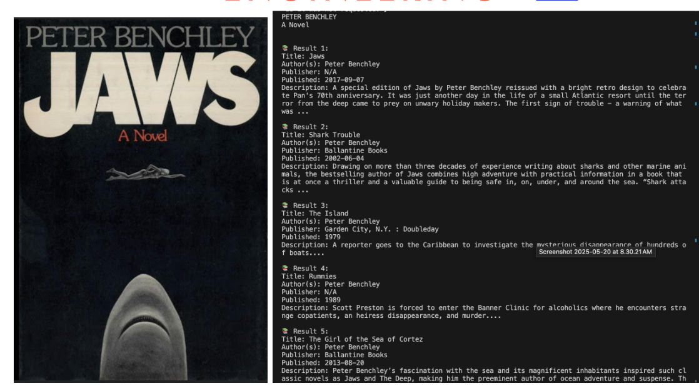
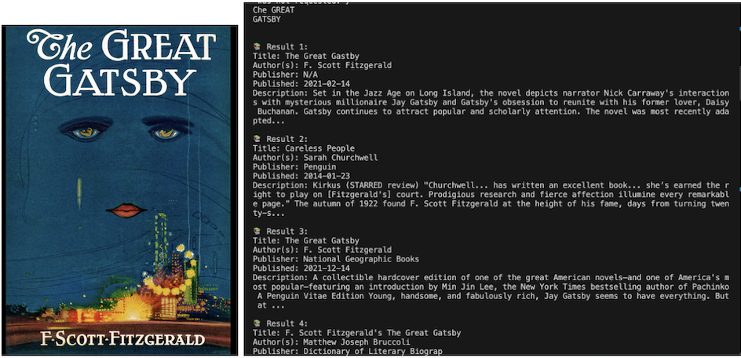
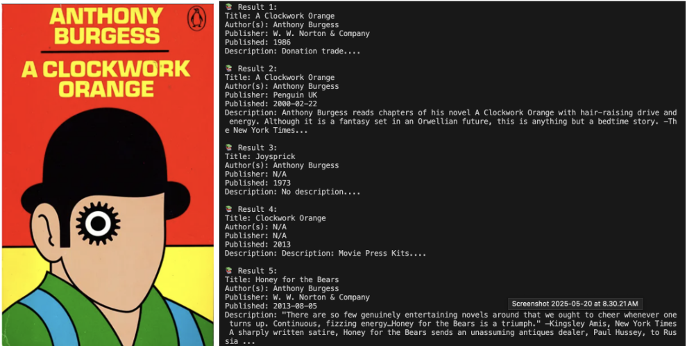
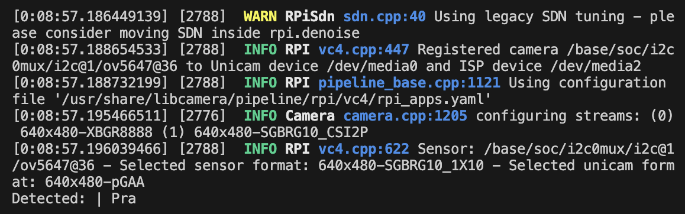
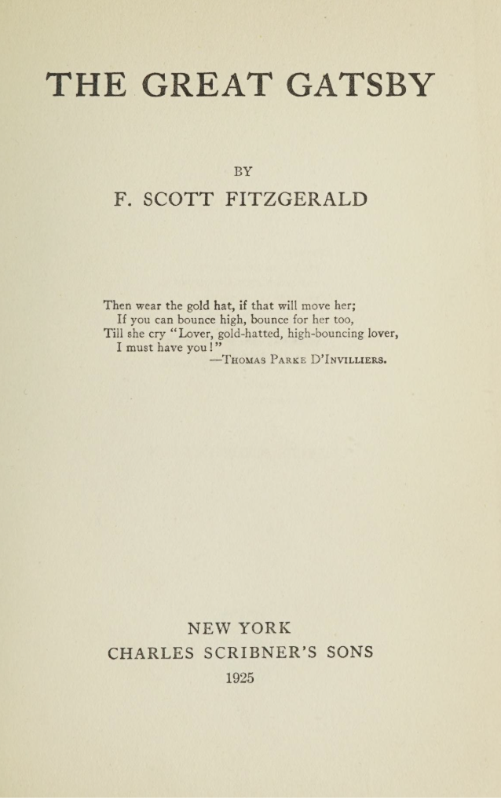
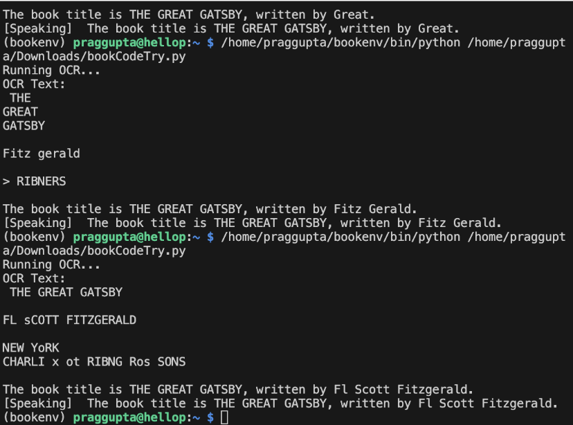

# Book Detector
I originally started this project with smart glasses, but during development, I transitioned to creating a website that detects books. The site allows users to take a picture of a book and receive information along with five recommendations. It integrates the Gemini API, Google Books API, and a custom recommendation algorithm to deliver a range of useful features. I plan to add even more functionality in the future.
 
| **Engineer** | **School** | **Area of Interest** | **Grade** |
|:--:|:--:|:--:|:--:|
| Pragti G | Monta Vista High School | Software Engineering | Incoming Junior

<!--Replace the BlueStamp logo below with an image of yourself and your completed project. Follow the guide [here](https://tomcam.github.io/least-github-pages/adding-images-github-pages-site.html) if you need help. -->

  
# Final Milestone

<iframe width="560" height="315" src="https://www.youtube.com/embed/H6bi_PE4X9o?si=RHki3qWzc1t0U80w" title="YouTube video player" frameborder="0" allow="accelerometer; autoplay; clipboard-write; encrypted-media; gyroscope; picture-in-picture; web-share" referrerpolicy="strict-origin-when-cross-origin" allowfullscreen></iframe>

<!--For your final milestone, explain the outcome of your project. Key details to include are:
- What you've accomplished since your previous milestone
- What your biggest challenges and triumphs were at BSE
- A summary of key topics you learned about
- What you hope to learn in the future after everything you've learned at BSE-->

## Summary
I created a [website](https://bookproject-uqgfcfnidbiqma9cucrkcf.streamlit.app/) with streamlit to take a picture of a book with your device camera, detect the text using a gemini api, provide details with a google books api, and get reccomendations from my own algorithm.

## Steps
I got a new camera with better quality, hoping it would improve the OCR results, and it probably did. But when I applied the filters, it started detecting every small texture as a word or character, which messed up the detection. So, I decided to find another OCR service as a backup, just to have something working in case I couldn’t fix the filters quickly enough.

I found an API called ocr.space that lets you upload pictures and returns the detected text. However, it wasn’t very reliable either. After that, I discovered a Gemini API, which worked every time. This service was able to detect text not just based on the words themselves but also by understanding the context.
```bash
pip install google-genai
```

After a while, I moved on from the filters and started focusing on using the Gemini API so I could work on adding more features.

At this point, I got a Google Books API and had code that took a picture from my Pi camera and uploaded it to Gemini, which extracted the text. Then, it sent the title and author to the Google Books API, which generated the top 5 results that matched the title entered. After that, I asked Gemini to generate 5 recommendations for the book.
 

 

For this code the users would have to use the terminal, which isn't very user friendly, so I was advised to make my own website.

In order to build my website, I used Streamlit—an open-source Python framework that allowed me to build the site using Python.
```bash
pip install streamlit
```

Once I had all the buttons set up to take a picture and retrieve information about the book, I decided to create my own recommendation algorithm.
I had looked at this github page for inspiration and guidance: [Book Recommendation System](https://github.com/vb8146649/Book-Recommend-System/tree/main?tab=readme-ov-file)

I began working in google colab notebook, where I was able to experiment freely and chunk up my code into different relevent sections. [My Notebook](https://colab.research.google.com/drive/1MSKweRVUYagDJmegP_dTD1MUTnL7cfKI?usp=sharing)

I originally wanted to use the author and the tags to recommend books, but I narrowed it down to just the tags. I used the Goodreads database: one file with tag IDs and tag names, one with tag IDs and book IDs, and the last one with book IDs, book names, authors, ratings, etc.

The basic idea of my algorithm is that it takes the title and author and tries to find the book in the database. Once it's found, it gets the book ID, then the tags associated with that book. It then compares those tags with the tags of every other book and gives each one a score based on how many tags they have in common. The top 5 highest-scoring books are returned as recommendations.

#### Outline
importing all the necessary packages
```python
import pandas as pd #allows me to create the set with the right columns and rows
```
loading all the datasets from GoodReads 10k project
```python
tags_url = "https://raw.githubusercontent.com/zygmuntz/goodbooks-10k/master/tags.csv" #tag_id,tag_name
book_tags_url = "https://raw.githubusercontent.com/zygmuntz/goodbooks-10k/master/book_tags.csv" #goodreads_book_id,tag_id,count
books_url = "https://raw.githubusercontent.com/zygmuntz/goodbooks-10k/master/books.csv"#titles, authors, publication details, ratings, and cover image URLs
books = pd.read_csv(books_url)
tags = pd.read_csv(tags_url)
book_tags = pd.read_csv(book_tags_url)
```
Setting up the dataset with the right columns to help find similar books.
```python
book_tags_merged = pd.merge(book_tags, tags, on='tag_id') # Merge book_tags with tags
book_tags_set = book_tags_merged.groupby('goodreads_book_id')['tag_name'].agg(set).reset_index() #combines book id and the tags asscoiated with it

# Add book titles and authors by merging with books, so I can get author+title and get the id then get the tags
books_subset = books[['goodreads_book_id', 'title', 'authors']]
book_tags_set = pd.merge(book_tags_set, books_subset, on='goodreads_book_id')

# Rename and reorder columns
book_tags_set.rename(columns={'goodreads_book_id': 'book_id', 'tag_name': 'tags'}, inplace=True)
book_tags_set = book_tags_set[['book_id', 'title', 'authors', 'tags']]
```
recommend_books_by_title_author finds the book ID by title and author, then calls recommend_books to get recommendations based on tags.
```python
def recommend_books(book_id, book_tags_df, top_n=5):
    df = book_tags_df.copy()

    target_tags = df.loc[df['book_id'] == book_id, 'tags'].values
    if len(target_tags) == 0:
        print("Book ID not found.")
        return None

    target_tags = target_tags[0]

    def tag_overlap(row):
        return len(target_tags.intersection(row['tags']))

    df['overlap'] = df.apply(tag_overlap, axis=1)
    recommendations = df[df['book_id'] != book_id].sort_values(by='overlap', ascending=False).head(top_n)

    return recommendations[['book_id', 'title', 'tags', 'overlap']]

def recommend_books_by_title_author(title, author, book_tags_df, top_n=5):
    # Normalize title and author for matching
    title = title.strip().lower()
    author = author.strip().lower()

    # Find the matching book
    matched_book = book_tags_df[
        book_tags_set['title'].str.lower().str.contains(title) &
      book_tags_set['authors'].str.lower().str.contains(author)
    ]

    if matched_book.empty:
        print(f"No book found with title '{title}' and author '{author}'")
        return None

    book_id = matched_book.iloc[0]['book_id']
    target_title = matched_book.iloc[0]['title']
    print(f"\nFound Book: '{target_title}' (ID: {book_id}) — generating recommendations...\n")

    return recommend_books(book_id, book_tags_df, top_n=top_n)
```
Example run with <u>Harry Potter and the Prisoner of Azkaban</u> and with part of the author's name to test partial matching
```python
book_title = "Harry Potter and the Prisoner of Azkaban"
book_author = "J.K"

recommendations = recommend_books_by_title_author(book_title, book_author, book_tags_set, top_n=5)

if recommendations is not None:
    print(recommendations[['book_id', 'title', 'overlap']])
```
Output:
```text
Found Book: 'Harry Potter and the Prisoner of Azkaban (Harry Potter, #3)' (ID: 5) — generating recommendations...

      book_id                                              title  overlap
2           3  Harry Potter and the Sorcerer's Stone (Harry P...       96
1276    15881  Harry Potter and the Chamber of Secrets (Harry...       95
0           1  Harry Potter and the Half-Blood Prince (Harry ...       94
4           6  Harry Potter and the Goblet of Fire (Harry Pot...       93
3890   136251  Harry Potter and the Deathly Hallows (Harry Po...       92
```
The next thing I did after implementing the recommendation feature, was improve UI(user interface).
I used a config.toml to change the color, theme, and change the font, used a css file to change the color and text of the buttons, and used markdown to change the background the text size.

Then I deployed my website on streamlit cloud, which allows me to deploy my website directly from my [github repo](https://github.com/Awsum123/BookProject).


## Challenges

## Next Steps


# Second Milestone

<iframe width="560" height="315" src="https://www.youtube.com/embed/QT4CJaUCVO4?si=ClKCGyMrA-sgbFvg" title="YouTube video player" frameborder="0" allow="accelerometer; autoplay; clipboard-write; encrypted-media; gyroscope; picture-in-picture; web-share" referrerpolicy="strict-origin-when-cross-origin" allowfullscreen></iframe>

<!--For your second milestone, explain what you've worked on since your previous milestone. You can highlight:
Technical details of what you've accomplished and how they contribute to the final goal
What has been surprising about the project so far
Previous challenges you faced that you overcame
What needs to be completed before your final milestone-->
## Summary
For my second milestone, I followed the steps from [Running TensorFlow Lite Object Recognition on the Raspberry Pi 4 or Pi 5](https://learn.adafruit.com/running-tensorflow-lite-on-the-raspberry-pi-4/tensorflow-2-setup) to detect objects using my Pi camera. After setting it up, I figured out that instead of detecting a bunch of objects unreliably, I want to detect text, specifically book titles and authors, to obtain data about that particular book. So, I downloaded OCR(optical character recognition) and spaCy's en_core_web_sm model. This setup allows me to extract text from images and then use NER(Named Entity Recognition) to identify and label titles and authors separately.


## Steps
#### Update the Raspberry Pi
```bash
sudo apt update
sudo apt upgrade -y
sudo apt install -y python3-pip
sudo apt install --upgrade -y python3-setuptools
```
Pip is a Python package installer for Python 3.

#### Setup Virtual Environment
```bash
sudo apt install python3.11-venv
python -m venv env --system-site-packages
```
Ran commands that allow me to create a virtual environment in Python — important because it allows me to run code in an isolated environment.
Creates env.
Not understanding this caused a lot of problems due to global files interfering with files I was trying to install in virtual environments.
```bash
source env/bin/activate
```
Activates the environment created.


#### Upgrade Script
```bash
cd ~
sudo pip3 install --upgrade adafruit-python-shell
wget https://raw.githubusercontent.com/adafruit/Raspberry-Pi-Installer-Scripts/master/raspi-blinka.py
sudo python3 raspi-blinka.py
```
This caused a lot of errors about externally managed environments because I was in an environment and I was using sudo, which was trying to install it through the whole Pi, so getting rid of sudo allowed it to run.
Installs or upgrades the Adafruit Python Shell.
Downloads the raspi-blinka.py.
Necessary to control board.
#### Tensor flow - Install requirements
```bash
sudo apt install -y python3-numpy python3-pillow python3-pygame
```
Downloaded 3 Python packages that allow for fast computing (data processing), image processing, and making games with visuals and audio.
```bash
sudo apt install -y festival
```
Speech package

#### Install rpi-vision
```bash
cd ~
source env/bin/activate
git clone --depth 1 https://github.com/adafruit/rpi-vision.git
cd rpi-vision
pip3 install -e .
```
Installing fork of Adafruit program for detecting objects.
#### Install TensorFlow 2.x
```bash
RELEASE=https://github.com/PINTO0309/Tensorflow-bin/releases/download/v2.15.0.post1/tensorflow-2.15.0.post1-cp311-none-linux_aarch64.whl
CPVER=$(python --version | grep -Eo '3\.[0-9]{1,2}' | tr -d '.')
pip install $(echo "$RELEASE" | sed -e "s/cp[0-9]\{3\}/CP$CPVER/g")
```
Installs TensorFlow, an open-source library for machine learning — gives ability to run AI models to detect the objects.

#### Running the Graphic Labeling Demo
```bash
cd rpi-vision
python3 tests/pitft_labeled_output.py --tflite
```
Captures camera image and uses TFLite (TensorFlow Lite) to do object detection — supposed to display to PiTFT screen but I use VNC to stream the video onto my computer.
This makes my Pi heat up to crazy temps, so I added heat sinks.
Also, whatever is detected is outputted in audio form as well.

After getting object detection set up, I realized that it is really, really bad (probably due to camera quality or that the model has so many things to detect that it can’t do everything).
So I decided that I want to focus on detecting books (getting the title and author), then getting information about it and outputting it in audio form to the user.

I started by downloading OCR.
I was only able to detect “Hello” from my iPhone screen properly. Then I started using OpenCV to add filters — helping OCR to isolate words and detect them.
##### Figure 7+8: A picture taken from my pi camera and The same picture with more filters
       

##### Figure 6: The detected words from the filtered picture


Next, I needed to separate author and book title, so I used NER (Named Entity Recognition), which is a part of NLP (Natural Language Processing).

“Named Entity Recognition (NER) in NLP focuses on identifying and categorizing important information known as entities in text.”
Like people, places, dates, quantities.

```bash
pip install spacy
pip install nltk
python -m spacy download en_core_web_sm
```

I had to install SpaCy, which is an open-source library for natural language processing, which allows computers to understand human languages.
I also installed en_core_web_sm, which is the English model for SpaCy.

I also had a lot of problems in this part because I decided to use another environment to download all these packages, since there were some problems with NumPy and SpaCy.
So I created another environment, and I forgot to switch interpreters, so when running my code I got the same error of en_core_web_sm not being able to be used even though it was installed.
So I needed to switch interpreters in VS Code and enter the right environment.

At this point, I just wanted to test if my setup worked without my Pi cam.
So I took pictures from Google of book covers and ran my code, trying to detect the author with a person entity and the book title with heuristics (guessing/good enough).
I was using filters again, but the problem this time is that some book covers aren’t clean enough and the words get blocked out — due to one section being darker and then when comparing the sections, it blocks out the words instead of the background.
So I started just using the inside pages of books with the title and author on a blank page, and it was able to separate the author and title for one picture perfectly.
##### Figure 4+5: The inside page of <u>The Great Gatsby</u> and the detected title and author
 

So now my next steps are to clean up the detection for the author because the person detection isn’t always working, and then adjust filters until I’m able to use the book cover reliably.

## Challenges
## Next Steps

# First Milestone

<iframe width="560" height="315" src="https://www.youtube.com/embed/jj_O0dZNq4Q?si=ML43E9GmnBaIR7hE" title="YouTube video player" frameborder="0" allow="accelerometer; autoplay; clipboard-write; encrypted-media; gyroscope; picture-in-picture; web-share" referrerpolicy="strict-origin-when-cross-origin" allowfullscreen></iframe>

<!--For your first milestone, describe what your project is and how you plan to build it. You can include:
- An explanation about the different components of your project and how they will all integrate together
- Technical progress you've made so far
- Challenges you're facing and solving in your future milestones
- What your plan is to complete your project-->
## Summary
My first milestone was to set up my raspberry pi, connect a camera, and take a picture.
##### Figure 3: A picture taken from my pi camera


## Steps
<!--The first thing I did was to flash the SD card. I replaced the preloaded 32 bit operating system with a 64 bit, allowing me to download all the libraries I would need for this project. After inserting the SD card into the Pi, I hooked my computer to my raspberry pi with a video capture card, allowing me to use my computer as a moniter, and enabled ssh(secure shell) in OBS. Secure shell allows the raspberry pi to be accessed remotely, while encrypting data through the network. The next step was to setup desktop setup by downloading tigervnc and vscode connecting it to my raspberry pi using ssh, so I can interface with my raspberry pi, run and edit code. -->

The first thing I did was flash the SD card. I replaced the preloaded 32-bit operating system with a 64-bit version, which allowed me to download all the libraries needed for this project. After inserting the SD card into the Raspberry Pi, I connected it to my computer using a video capture card, allowing me to use my computer as a monitor. I then enabled SSH (Secure Shell) in OBS. Secure Shell allows the Raspberry Pi to be accessed remotely while encrypting data transmitted over the network.

Next, I set up the desktop environment by installing TigerVNC and Visual Studio Code, connecting to the Raspberry Pi via SSH. This setup allows me to interface with the Pi and run and edit code directly from my computer. Now I'm able to use my raspberry pi without an external keyboard, mouse, and without the video capture.

Finally, I installed opencv:
```bash
sudo apt-get update
sudo apt-get upgrade
sudo apt-get install libopencv-dev
sudo apt-get install python3-opencv
```
Making it easier to capture images and manipulate them.

This is the code I used to capture pictures.
``` python
from picamera2 import Picamera2, Preview
import time
import cv2
picam2 = Picamera2()
camera_config = picam2.create_still_configuration(main={"size": (1920, 1080)},
lores={"size": (640, 480)}, display="lores")
picam2.configure(camera_config)
#picam2.start_preview(Preview.QTGL) #Comment this out if not using desktop interface
picam2.start()
time.sleep(2)
im = picam2.capture_array()
im = cv2.cvtColor(im, cv2.COLOR_BGR2RGB)
cv2.imwrite('file.png', im)
```


## Challenges
Checked wifi connection with pinging the raspberry pi 
The host name wasn’t working so had to use the ip address
Basically just checks if the raspberry pi is there

ssh wasn't working due to network issues had to depend on Obs which 
So capture takes html video signals to usb signals so i can use my computer instead of a monitor then obs switches it back to hdmi signals and converts it to video we can see


## Next Steps

<!--# Schematics 
Here's where you'll put images of your schematics. [Tinkercad](https://www.tinkercad.com/blog/official-guide-to-tinkercad-circuits) and [Fritzing](https://fritzing.org/learning/) are both great resoruces to create professional schematic diagrams, though BSE recommends Tinkercad becuase it can be done easily and for free in the browser. -->

# Code
## Code for Raspberry Pi with Arducam
```python
import google.generativeai as genai
from PIL import Image
import requests
from picamera2 import Picamera2
import cv2
import time

picam2 = Picamera2()
picam2.start()

# Trigger autofocus
picam2.set_controls({"AfMode": 2})
time.sleep(2)  # time for autofocusing to work

image_path = "autofocused_image2.jpg"
picam2.capture_file(image_path)
picam2.stop()


GOOGLE_API_KEY = "YOUR_API_KEY"
genai.configure(api_key=GOOGLE_API_KEY)

def load_image_as_base64(path):
    with open(path, "rb") as img_file:
        return img_file.read()

image_path = "autofocused_image2.jpg"
image_bytes = load_image_as_base64(image_path)

model = genai.GenerativeModel("gemini-1.5-flash")

response = model.generate_content([
    "Extract all readable text from this image (OCR):",
    {"mime_type": "image/png", "data": image_bytes}
])

def search_google_books(query, max_results=5):
    url = "https://www.googleapis.com/books/v1/volumes"
    params = {
        "q": query,
        "maxResults": max_results,
        "key": "YOUR_API_KEY", 
    }

    response = requests.get(url, params=params)
    data = response.json()

    if "items" not in data:
        print("No results found.")
        return

    for i, item in enumerate(data["items"], 1):
        volume_info = item.get("volumeInfo", {})
        title = volume_info.get("title", "N/A")
        authors = volume_info.get("authors", ["N/A"])
        publisher = volume_info.get("publisher", "N/A")
        published_date = volume_info.get("publishedDate", "N/A")
        rating = volume_info.get("averageRating", "No rating")
        ratings_count = volume_info.get("ratingsCount", 0)
        description = volume_info.get("description", "No description.")
        page_count = volume_info.get("pageCount", "Unknown")
        

        print(f"\nResult {i}:")
        print(f"Title: {title}")
        print(f"Author(s): {', '.join(authors)}")
        print(f"Publisher: {publisher}")
        print(f"Published: {published_date}")
        print(f"Description: {description}")
        print(f"Rating: {rating} ({ratings_count} ratings)")  
        print(f"Page Count: {page_count}")  


print("Extracted Text:\n", response.text)
search_google_books(response.text)


   
recommendations = model.generate_content([
    "Get 5 recommendations similar to this book title: "+ response.text
])

series = model.generate_content([
    "Tell me if this book title: "+ response.text + "is part of a book series. If so tell me the other books. Don't start off with yes or no"+
    "can you say the number of books in the series first"
])
print(recommendations.text)
print(series.text)
```

## Code for website

### Setting up website functionalities  
```python
import streamlit as st
import os
from PIL import Image
from sklearn.preprocessing import MultiLabelBinarizer
from sklearn.metrics.pairwise import cosine_similarity
from bookFunctions import (
    init_genai,
    extract_title_and_author,
    search_google_books,
    parse_title_author,
    get_recommendations,
    check_book_series,
)
from bookRecs import(
    recommend_books,
    recommend_books_by_title_author,
    prepare_book_tags_set, load_data,
    recommend_books_cosine
)
import pandas as pd
import base64

# --- Base64 Background Setup ---
def get_base64(file_path):
    with open(file_path, "rb") as f:
        data = f.read()
    return base64.b64encode(data).decode()

image_path = "background.png"
encoded_image = get_base64(image_path)


<style>
.stApp {
    background-image: url("data:image/jpg;base64,iVBORw0KGgoAAAANS..."); /* your base64 data */
    background-size: cover;
    background-repeat: no-repeat;
    background-attachment: fixed;
}
</style>


# --- Load CSS ---
def local_css(file_name):
    with open(file_name) as f:
        st.markdown(f'<style>{{f.read()}}</style>', unsafe_allow_html=True)

local_css("style.css")

# --- Page Config ---
st.set_page_config(page_title="Book Finder", layout="centered")

# --- Caching Functions ---
@st.cache_data(show_spinner=True)
def cached_load_data():
    return load_data()

@st.cache_data(show_spinner=True)
def cached_prepare_book_tags_set(books, book_tags, tags):
    return prepare_book_tags_set(books, book_tags, tags)

@st.cache_resource(show_spinner=True)
def cached_init_genai():
    return init_genai(os.getenv('gemini'))

# --- Speech Recognition JS ---
st.markdown("""
<script>
function startDictationOnce() {
    if (window.hasOwnProperty('webkitSpeechRecognition')) {
        var recognition = new webkitSpeechRecognition();
        recognition.continuous = false;
        recognition.interimResults = false;
        recognition.lang = "en-US";
        recognition.start();

        recognition.onresult = function(e) {
            const transcript = e.results[0][0].transcript;
            const inputField = document.getElementById("speech_result");
            inputField.value = transcript;
            inputField.dispatchEvent(new Event('input', { bubbles: true }));
            recognition.stop();
        };

        recognition.onerror = function(e) {
            recognition.stop();
        };
    }
}
</script>
""", unsafe_allow_html=True)

# --- Load Models/Data ---
books, book_tags, tags = cached_load_data()
book_tags_set = cached_prepare_book_tags_set(books, book_tags, tags)
MODEL = cached_init_genai()

# --- UI ---
st.title("Book Identifier")
st.markdown('<p style="font-size:25px;">Take a picture of a book to get details, recommendations, and more.</p>', unsafe_allow_html=True)

if 'show_camera' not in st.session_state:
    st.session_state.show_camera = False

st.markdown("""
    <style>
    .stButton button p { font-size: 18px !important; }
    </style>
""", unsafe_allow_html=True)

if st.button("Take Picture", type="primary"):
    for key in ['image_bytes', 'ocr_text', 'title_author', 'books']:
        st.session_state.pop(key, None)
    st.session_state.show_camera = True
    st.session_state.manual_entry = False

if st.button("Enter Title and Author Instead"):
    for key in ['image_bytes', 'ocr_text', 'title_author', 'books']:
        st.session_state.pop(key, None)
    st.session_state.manual_entry = True
    st.session_state.show_camera = False

if st.session_state.get('manual_entry', False):
    title = st.text_input("Enter Book Title:")
    author = st.text_input("Enter Author Name:")
    if title and author:
        st.session_state.title_author = (title, author)
        st.session_state.books = search_google_books(f"intitle:{title} inauthor:{author}", max_results=15)

img_file = None
if st.session_state.show_camera:
    img_file = st.camera_input("Take a picture")

if img_file is not None:
    st.session_state.image_bytes = img_file.getvalue()
    st.session_state.show_camera = False

if 'image_bytes' in st.session_state:
    if 'ocr_text' not in st.session_state:
        st.session_state.ocr_text = extract_title_and_author(MODEL, st.session_state.image_bytes)

    if 'title_author' not in st.session_state:
        title, author = parse_title_author(st.session_state.ocr_text)
        st.session_state.title_author = (title, author)

    if 'books' not in st.session_state:
        title, author = st.session_state.title_author
        st.session_state.books = search_google_books(f"intitle:{title} inauthor:{author}", max_results=15)

if 'title_author' in st.session_state and 'books' in st.session_state:
    books = st.session_state.books
    title, author = st.session_state.title_author

    st.markdown(f"<p style='font-size: 20px;'>Title: {title}</p>", unsafe_allow_html=True)
    st.markdown(f"<p style='font-size: 20px;'>Author: {author}</p>", unsafe_allow_html=True)

    book_titles = [f"{b['title']} by {', '.join(b['authors'])}" for b in books]

    maxSelected = max(books, key=lambda b: b.get('ratings_count', 0))
    default_index = books.index(maxSelected)

    if "book_select" not in st.session_state or st.session_state.book_select not in book_titles:
        st.session_state.book_select = book_titles[default_index]

    selected = st.selectbox("Choose a book:", book_titles, key="book_select")
    selected_book = books[book_titles.index(selected)]

    actions = ["Show Details", "Other Recommendations", "Show other books in series"]
    action = st.selectbox("Choose an action:", actions)

    if action == "Show Details":
        st.subheader("Book Details")
        st.write(f"**Title:** {selected_book['title']}")
        st.write(f"**Author(s):** {', '.join(selected_book['authors'])}")
        st.write(f"**Publisher:** {selected_book.get('publisher', 'N/A')}")
        st.write(f"**Published:** {selected_book.get('published_date', 'N/A')}")
        st.write(f"**Description:** {selected_book.get('description', 'No description available')}")
        st.write(f"**Rating:** {selected_book.get('rating', 'N/A')} ({selected_book.get('ratings_count', 0)} ratings)")
        st.write(f"**Page Count:** {selected_book.get('page_count', 'N/A')}")
        st.write(f"**List Price:** {selected_book.get('list_price', 'N/A')}")
        st.write(f"**Retail Price:** {selected_book.get('retail_price', 'N/A')}")

    elif action == "Other Recommendations":
        recommendations = recommend_books_by_title_author(
            selected_book['title'],
            ", ".join(selected_book['authors']),
            book_tags_set,
            top_n=5
        )
        st.write(f"Generating recommendations based on: **{selected_book['title']}** by **{', '.join(selected_book['authors'])}**")
        if recommendations is not None and not recommendations.empty:
            for _, row in recommendations.iterrows():
                st.write(f"**{row['title']}**")
        else:
            st.write("Couldn’t find direct matches. Using AI-based recommendations:")
            ai_recs = get_recommendations(MODEL, title)
            if isinstance(ai_recs, list):
                for rec in ai_recs:
                    st.write(f"**{rec}**")
            elif isinstance(ai_recs, str):
                for rec in ai_recs.strip().split("\n"):
                    rec = rec.strip("-•* ")
                    if rec:
                        st.write(f"**{rec}**")
            else:
                st.write("No readable recommendations found.")

    elif action == "Show other books in series":
        series = check_book_series(MODEL, selected_book['title'])
        if series:
            st.write(series)
        else:
            st.write("This book is not part of a series.")
```

### All methods for Gemini and Google books
```python
import google.generativeai as genai
from PIL import Image
import streamlit as st
import requests
import re
import os


# ====== CONFIGURATION ======
GOOGLE_API_KEY = "ignore the key just use this"
BOOKS_API_KEY = "ignore the key just use this"
IMAGE_PATH = "autofocused_image2.jpg"


# ====== LOAD IMAGE BYTES ======
def load_image_as_bytes(path):
    with open(path, "rb") as img_file:
        return img_file.read()

# ====== INITIALIZE GEMINI ======
def init_genai(api_key):
    genai.configure(api_key=api_key)
    return genai.GenerativeModel('gemini-2.5-flash')

# ====== OCR TEXT EXTRACTION ======
def extract_title_and_author(model, image_bytes):
    prompt = (
        "From this book cover image, extract ONLY the book's title and author.\n"
        "Format your response exactly like this:\n\n"
        "Title: <title>\nAuthor: <author>\n\n"
        "Do not include any other information or explanation."
    )

    response = model.generate_content([
        prompt,
        {"mime_type": "image/png", "data": image_bytes}
    ])
    
    return response.text.strip()


def parse_title_author(response_text):
    match = re.search(r"Title:\s*(.+?)\s*Author:\s*(.+)", response_text, re.IGNORECASE)
    if match:
        title = match.group(1).strip()
        author = match.group(2).strip()
        return title, author
    return None, None

# ====== GOOGLE BOOKS SEARCH ======

def search_google_books(query, max_results=5):
    url = "https://www.googleapis.com/books/v1/volumes"
    params = {
        "q": query,
        "maxResults": max_results,
        "key": os.getenv('key'),
        "country": "US"
    }
    response = requests.get(url, params=params)
    data = response.json()

    if "items" not in data:
        return []

    results = []

    for item in data["items"]:
        volume_info = item.get("volumeInfo", {})
        sale_info = item.get("saleInfo", {})

        list_price_data = sale_info.get("listPrice", {})
        retail_price_data = sale_info.get("retailPrice", {})

        list_price = f"{list_price_data.get('amount')} {list_price_data.get('currencyCode')}" \
            if list_price_data else "Unknown"

        retail_price = f"{retail_price_data.get('amount')} {retail_price_data.get('currencyCode')}" \
            if retail_price_data else "Unknown"

        book_data = {
            "title": volume_info.get("title", "N/A"),
            "authors": volume_info.get("authors", ["N/A"]),
            "publisher": volume_info.get("publisher", "N/A"),
            "published_date": volume_info.get("publishedDate", "N/A"),
            "description": volume_info.get("description", "No description."),
            "rating": volume_info.get("averageRating", "No rating"),
            "ratings_count": volume_info.get("ratingsCount", 0),
            "page_count": volume_info.get("pageCount", "Unknown"),
            "list_price": list_price,
            "retail_price": retail_price,
        }
        results.append(book_data)

    return results

    # ====== RECOMMENDATIONS ======
def get_recommendations(model, book_title):
    response = model.generate_content([
        "Get 5 recommendations similar to this book title: " + book_title +" just list out the reccomendations don't add any extra explanation"
    ])
    return response.text

# ====== SERIES CHECK ======
def check_book_series(model, book_title):
    prompt = (
        "Tell me if this book title: " + book_title +
        " is part of a book series. If so, tell me the other books in the series. " +
        "Don't start with yes or no. Start by saying the number of books in the series first."
    )
    response = model.generate_content(prompt)
    return response.text
```

### Recommendations Algorithm
```python
import pandas as pd
import re
from rapidfuzz import fuzz
from sklearn.preprocessing import MultiLabelBinarizer
from sklearn.metrics.pairwise import cosine_similarity

def clean_text(text):
    # Remove punctuation, lower case, collapse whitespace
    text = re.sub(r'[^\w\s]', '', text)  # Remove punctuation
    text = text.lower()
    text = re.sub(r'\s+', ' ', text)     # Collapse multiple spaces
    return text.strip()

def load_data():
    """Load raw CSVs from URLs and return DataFrames."""
    tags_url = "https://raw.githubusercontent.com/zygmuntz/goodbooks-10k/master/tags.csv"
    book_tags_url = "https://raw.githubusercontent.com/zygmuntz/goodbooks-10k/master/book_tags.csv"
    books_url = "https://raw.githubusercontent.com/zygmuntz/goodbooks-10k/master/books.csv"
    
    tags = pd.read_csv(tags_url)
    book_tags = pd.read_csv(book_tags_url)
    books = pd.read_csv(books_url)
    
    return books, book_tags, tags


"""def prepare_book_tags_set(books, book_tags, tags):
    book_tags_merged = pd.merge(book_tags, tags, on='tag_id')
    book_tags_set = book_tags_merged.groupby('goodreads_book_id')['tag_name'].agg(set).reset_index()
    books_subset = books[['goodreads_book_id', 'title', 'authors']]
    book_tags_set = pd.merge(book_tags_set, books_subset, on='goodreads_book_id')
    book_tags_set.rename(columns={'goodreads_book_id': 'book_id', 'tag_name': 'tags'}, inplace=True)
    book_tags_set = book_tags_set[['book_id', 'title', 'authors', 'tags']]

    # Add normalized versions for robust matching
    book_tags_set['norm_title'] = book_tags_set['title'].apply(clean_text)
    book_tags_set['norm_authors'] = book_tags_set['authors'].apply(clean_text)

    return book_tags_set
    print(book_tags_set.columns)"""

def prepare_book_tags_set(books, book_tags, tags):
    book_tags_merged = pd.merge(book_tags, tags, on='tag_id')
    book_tags_set = book_tags_merged.groupby('goodreads_book_id')['tag_name'].agg(set).reset_index()
    books_subset = books[['goodreads_book_id', 'title', 'authors']]
    book_tags_set = pd.merge(book_tags_set, books_subset, on='goodreads_book_id')
    book_tags_set.rename(columns={'goodreads_book_id': 'book_id', 'tag_name': 'tags'}, inplace=True)
    book_tags_set = book_tags_set[['book_id', 'title', 'authors', 'tags']]

    # Convert 'tags' column sets to frozensets for hashability
    book_tags_set['tags'] = book_tags_set['tags'].apply(frozenset)

    # Add normalized versions for robust matching
    book_tags_set['norm_title'] = book_tags_set['title'].apply(clean_text)
    book_tags_set['norm_authors'] = book_tags_set['authors'].apply(clean_text)

    return book_tags_set


def recommend_books(book_id, book_tags_df, top_n=5):
    """
    Recommend books based on tag overlap for a given book_id.
    Returns top_n recommendations sorted by tag overlap.
    """
    df = book_tags_df.copy()

    target_tags = df.loc[df['book_id'] == book_id, 'tags'].values
    if len(target_tags) == 0:
        print("Book ID not found.")
        return None

    target_tags = target_tags[0]

    def tag_overlap(row):
        return len(target_tags.intersection(row['tags']))

    df['overlap'] = df.apply(tag_overlap, axis=1)
    recommendations = df[df['book_id'] != book_id].sort_values(by='overlap', ascending=False).head(top_n)

    return recommendations[['book_id', 'title', 'tags', 'overlap']]


"""def recommend_books_by_title_author(title, author, book_tags_df, top_n=5):
    title_clean = clean_text(title)
    author_clean = clean_text(author)

    matched_book = book_tags_df[
        book_tags_df['norm_title'].str.contains(title_clean) & 
        book_tags_df['norm_authors'].str.contains(author_clean)
    ]
    
    if matched_book.empty:
        print(f"No book found with title '{title}' and author '{author}'")
        return None
    
    book_id = matched_book.iloc[0]['book_id']
    target_title = matched_book.iloc[0]['title']
    print(f"\nFound Book: '{target_title}' (ID: {book_id}) — generating recommendations...\n")
    
    return recommend_books(book_id, book_tags_df, top_n=top_n)
"""

def recommend_books_by_title_author(title, author, book_tags_df, top_n=5, threshold=70):
    title_clean = clean_text(title)
    author_clean = clean_text(author)

    best_match_score = 0
    best_match_idx = None

    # Iterate through the dataset to find best fuzzy match
    for idx, row in book_tags_df.iterrows():
        dataset_title = clean_text(row['title'])
        dataset_author = clean_text(row['authors'])

        title_score = fuzz.token_sort_ratio(title_clean, dataset_title)
        author_score = fuzz.token_sort_ratio(author_clean, dataset_author)

        # Combine scores - you can tweak the logic here
        combined_score = (title_score + author_score) / 2

        if combined_score > best_match_score and combined_score >= threshold:
            best_match_score = combined_score
            best_match_idx = idx

    if best_match_idx is None:
        print(f"No book found with title '{title}' and author '{author}' (threshold={threshold})")
        return None

    matched_book = book_tags_df.iloc[best_match_idx]
    book_id = matched_book['book_id']
    target_title = matched_book['title']
    print(f"\nFound Book: '{target_title}' (ID: {book_id}) — generating recommendations...\n")

    return recommend_books(book_id, book_tags_df, top_n=top_n)


def recommend_books_cosine(title, author, book_tags_df, similarity_matrix, top_n=5):
    title_clean = clean_text(title)
    author_clean = clean_text(author)

    matched = book_tags_df[
        book_tags_df['norm_title'].str.contains(title_clean) &
        book_tags_df['norm_authors'].str.contains(author_clean)
    ]

    if matched.empty:
        print(f"No match found for '{title}' by '{author}'.")
        return None

    target_idx = matched.index[0]
    similarities = similarity_matrix[target_idx]

    similar_indices = similarities.argsort()[::-1]
    similar_indices = [i for i in similar_indices if i != target_idx][:top_n]

    recommendations = book_tags_df.iloc[similar_indices][['title', 'authors']].copy()
    recommendations['similarity'] = similarities[similar_indices]

    print(f"\nFound Book: '{book_tags_df.loc[target_idx, 'title']}' — generating cosine-based recommendations...\n")
    return recommendations.reset_index(drop=True)
```

### Setting up base colors and fonts
```toml
[theme]
base="light"
primaryColor="#D3B8AE"
backgroundColor="#F7F2EF"
secondaryBackgroundColor="#EFEBE8" 
textColor="#4A4A4A"
font="sans serif"
```

### More Styling
```css
/* --- Button Styling --- */
.stButton>button {
    font-size: 1.1em;
    font-family: 'Open Sans', sans-serif;
    font-weight: bold;
    color: #333333;
    background-color: #D3B8AE;                          
    border: none;            
    border-radius: 8px;      
    padding: 10px 20px;      
}
.stButton>button:hover {
    background-color: #B4978D; /* <-- Slightly darker background on hover */
    cursor: pointer;
}
```


# Bill of Materials

| **Part** | **Note** | **Price** | **Link** |
|:--:|:--:|:--:|:--:|
| ~~Raspberry Pi~~ | Orginally used to control camera and locally run website | $109.99 | <a href="https://www.amazon.com/CanaKit-Raspberry-Pi-Starter-Kit/dp/B07V2B4W63/ref=sr_1_3?crid=1U2VL7PDY8UZ2&dib=eyJ2IjoiMSJ9.qObSl_jh-ZRJhliCkwUhOPr8NIXbnDGITPdCBNoR4Gggy77uvsQ5-O7U-FAdlCkJ8SLq1NrlL_2tTe5QXNWGSagnkKhLC2zkHoFu7QcWic1EKo1pZAjsfsaZUkJoi4nLYuD7F__BPZtV-6ahzxmNR7wxmT65MfTeIDqjhDgUkAT7u-XR3vBlAoDKVlv0VBjtjY1BYvqCTFEtB1xkdcFyO8UvqKPJcfFW9SJEHvU_2NM.r43O5eQ2tfmus7eWx4w9ufzFhKV_Sm6B5KEf6doTBlE&dib_tag=se&keywords=canakit%2Braspberry%2Bpi%2B4%2Bstarter%2Bkit%2B32gb%2Bevo%2B&qid=1753459025&sprefix=canakit%2Braspberry%2Bpi%2B4%2B32gb%2Caps%2C384&sr=8-3&th=1"> Link </a> |
| ~~Arducam with autofocus~~ | Orginally used to take pictures and videos for object detection | $25.00 | <a href="https://www.amazon.com/Arducam-Raspberry-Camera-Autofocus-15-22pin/dp/B0C9PYCV9S/ref=sr_1_1?dib=eyJ2IjoiMSJ9.EfDqm-I9V5Ti8yWG2pW_lGEyzg-IbAPQhF3v_7U6tn-I6_0Yj6DRENt03mbM-Vy7rt10z2P8iGUq0Phxxj2EWaxwtLleouZPyhi9vOt22n79OAV-ze-EWqumYJxlQ5vydK6VxaQZjRMh8frCETdYHOmQNOOwJ_IeqW-4ndlS5XnveMWsJ4MVaKxsLoqxAPTswDoVZJP-_Nckn8YACoZW477qjU4vRvI3eLoQ79tatcw.YDKJlEIJkWWbovdce9fx3MSUZGHs4X6HuyoU9DfeIo0&dib_tag=se&keywords=Raspberry+Pi+Camera+Module+3&qid=1751047927&sr=8-1"> Link </a> |
| ~~Key Board~~ | Typing in Raspberry Pi | $16.16 | <a href="https://www.amazon.com/AmazonBasics-Wired-Computer-Keyboard-10-Pack/dp/B00B7GV802/ref=sr_1_1_ffob_sspa?crid=28D2B1EG3B8R5&dib=eyJ2IjoiMSJ9.4JNDYIpbkFFA7va6FsTR3qZDodVli3ndhCgpQVKnePI-mYxgTFaj87-ZfkqwP5LY9bzCog9mzQfBb02UYODx6YhHLvYRz9iHIv38NZXfuL8m7EzTubp2Qe01ZW47NruIsv8Wn7AUbXD59kFSxfG2IwOX-FiOTkpXzx2owLLCSWxTdl8dnWgu3KghJZSRtZV-XUZYpk5DxXP5cyrvqGVTajj1ZCfGmLtNWoIlMjq-WH4.34cudBwwIIXrCaCTdMZaGQB0IxVe5Ic_GNtOVKo0iSo&dib_tag=se&keywords=amazon%2Bbasics%2Bkeyboard%2Band%2Bmouse&qid=1753460230&sprefix=amazon%2Bbasics%2Bkeyboard%2B%2Caps%2C368&sr=8-1-spons&sp_csd=d2lkZ2V0TmFtZT1zcF9hdGY&th=1"> Link </a> |

# Starter Project: Jitterbug 


<iframe width="560" height="315" src="https://www.youtube.com/embed/-ZHt3RgyCjU?si=4k7KgGRrm4ysOyv0" title="YouTube video player" frameborder="0" allow="accelerometer; autoplay; clipboard-write; encrypted-media; gyroscope; picture-in-picture; web-share" referrerpolicy="strict-origin-when-cross-origin" allowfullscreen></iframe>

My starter project is a jitterbug. It consists of a vibration motor, 2 leds, battery, on and off switch, and 6 metal wires that serve as legs. When you switch the bug on, the motor will start shaking the legs, propelling the bug. 

##### Figure 2: The completed jitterbug


##### Figure 1: The circuit of the jitterbug


<!--# Other Resources/Examples
One of the best parts about Github is that you can view how other people set up their own work. Here are some past BSE portfolios that are awesome examples. You can view how they set up their portfolio, and you can view their index.md files to understand how they implemented different portfolio components.
- [Example 1](https://trashytuber.github.io/YimingJiaBlueStamp/)
- [Example 2](https://sviatil0.github.io/Sviatoslav_BSE/)
- [Example 3](https://arneshkumar.github.io/arneshbluestamp/)

To watch the BSE tutorial on how to create a portfolio, click here.-->
